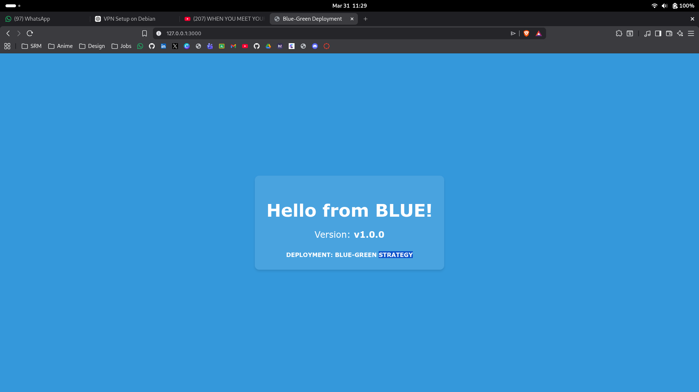
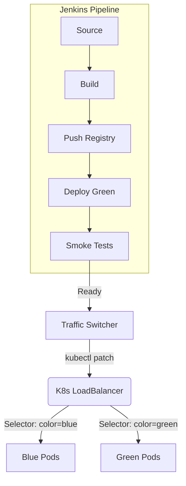

# ShiftOps: Production-Grade Blue-Green Dashboard

ShiftOps is a real-time DevOps control plane designed to orchestrate and visualize Blue-Green deployment strategies. It provides platform engineers with a unified interface to manage traffic switching, monitor pipeline logs, and handle instant rollbacks.



## 🚀 Core Concepts

### Blue-Green Strategy
At all times, two identical environments exist in Kubernetes:
- **BLUE**: The currently live environment serving 100% of production traffic.
- **GREEN**: The standby environment where new code is deployed and tested.

### Deployment Lifecycle
1. **Trigger**: Developer pushes code or manually triggers "Deploy to Green".
2. **Pipeline**: Jenkins orchestrates the build, push, and deploy to the `production-green` namespace.
3. **Smoke Tests**: Automated health checks verify the stability of the Green environment.
4. **Traffic Switch**: Upon manual approval, ShiftOps patches the Kubernetes Service selector to point to Green.
5. **Observation**: Blue is kept as a "warm standby" for instant rollback if anomalies are detected.

## 🛠 Tech Stack

- **Frontend**: Next.js 14, Tailwind CSS, Framer Motion
- **Backend API**: Next.js API Routes, SSE (Server-Sent Events) for real-time logs
- **Simulation**: Custom state machine engine for environment management
- **Visuals**: Github-inspired dark theme with high-contrast accenting

## 📖 Architecture Diagram



## 🛠 Local Setup

1. Install dependencies:
   ```bash
   npm install
   ```
2. Run development server:
   ```bash
   npm run dev
   ```
3. Open [http://localhost:3000](http://localhost:3000)

## 🔧 Jenkins Mock Integration
The `jenkins/Jenkinsfile` provided in this repo is designed to work with ShiftOps webhooks to update the dashboard state in real-time.

---
Built with ❤️ by [Arnazz10](https://github.com/Arnazz10)
